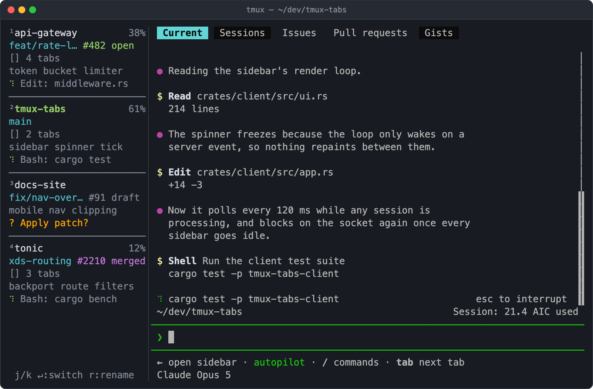
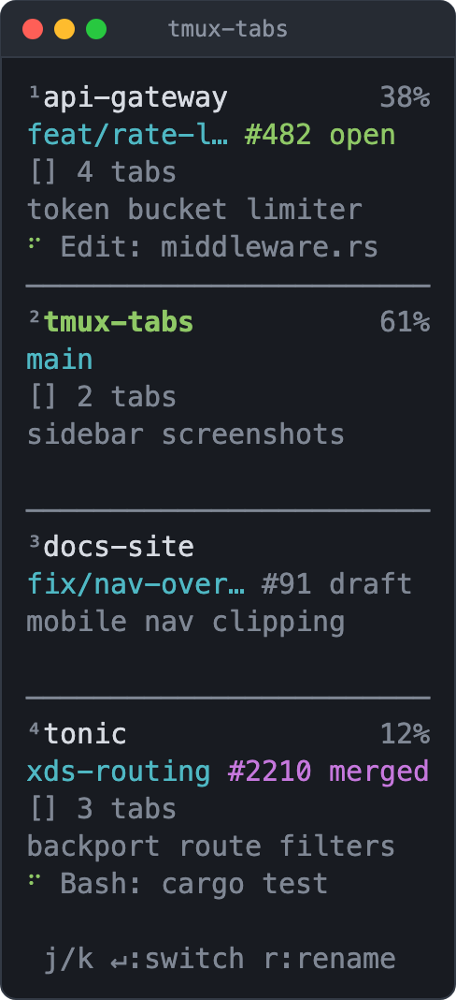
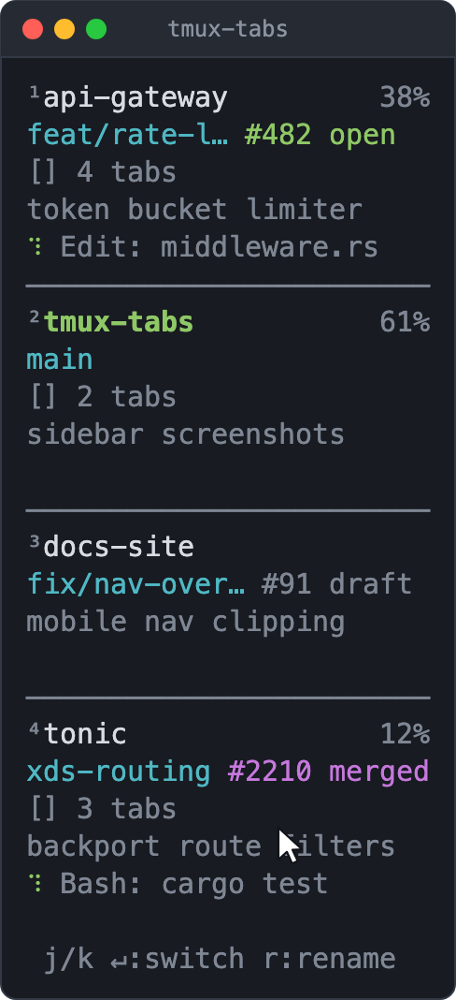
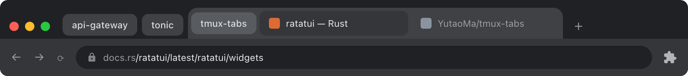
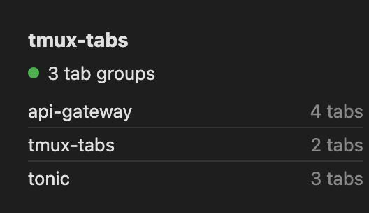
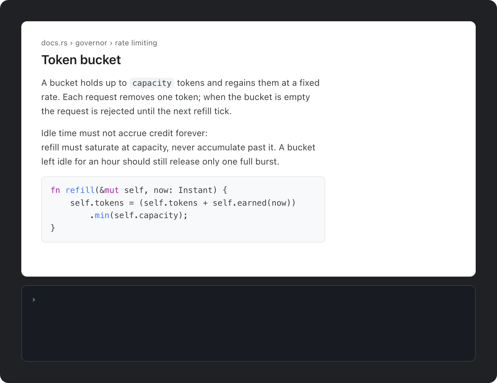
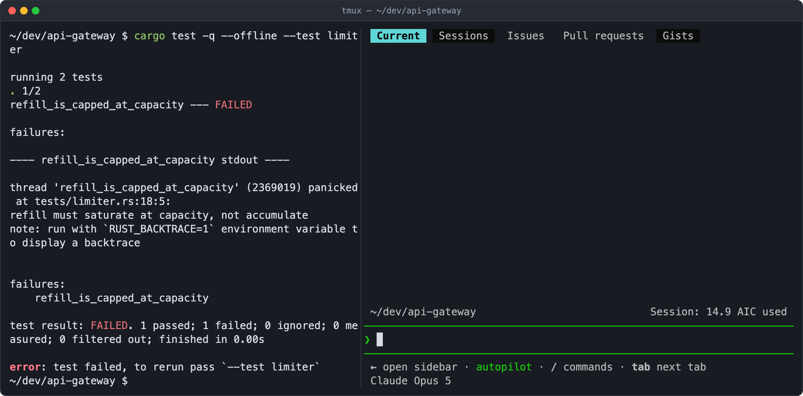
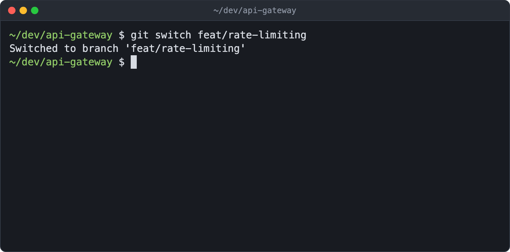
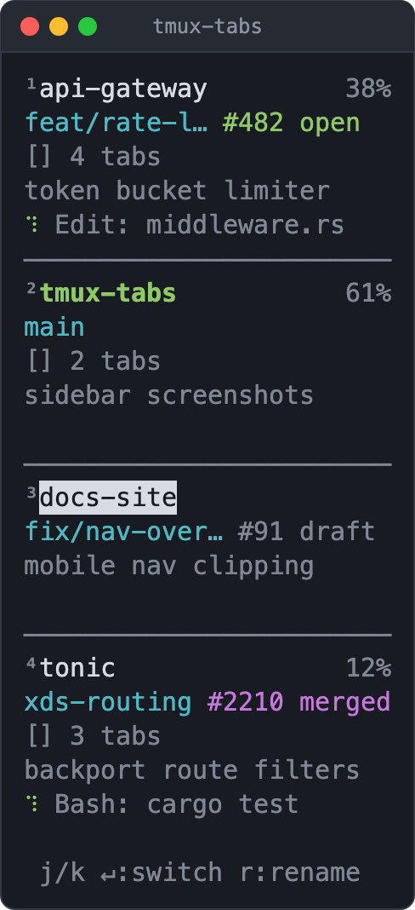
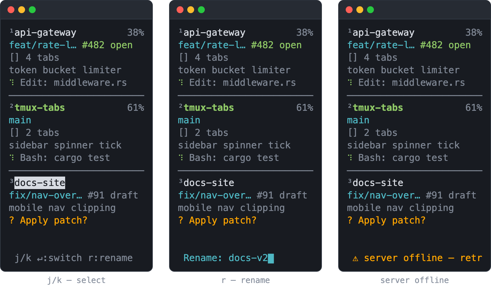

# tmux-tabs

Sidebar for managing tmux sessions — with first-class Claude Code and GitHub Copilot CLI integration, plus git and Chrome.

<p align="center">
  
</p>

## Features

### All AI sessions in a sidebar

<p align="center">
  
</p>

One card per tmux session, each showing:

- **Name**, prefixed with its `prefix + g` index — the current session is bold green, and context-window usage sits on the right
- **Git branch** plus a PR badge coloured by state: open / draft / merged / closed
- **Chrome tab group** size, when the browser bridge is connected
- **Topic** — what the AI session is currently working on
- **Status** — a spinner and the running tool while the agent works, or an orange `?` when it's waiting on you

Cards are driven by hooks, so Claude Code and Copilot CLI panes report the same
way: you can see at a glance which session is blocked on you and which is still
grinding.

### Quick switch between sessions

<p align="center">
  
</p>

The sidebar is mouse-driven: rolling the wheel over it steps through sessions
one at a time, and a click switches straight to the card under the pointer — no
keyboard round trip when you already have a hand on the mouse. From the
keyboard, `prefix + g + 1..9` jumps to a session by index from anywhere, and
`j`/`k` plus `Enter` work inside the sidebar pane. See
[Usage](#usage) for the full list.

### Chrome tab groups follow your tmux session

<p align="center">
  
</p>

Each tmux session gets a matching Chrome tab group. Switching sessions collapses
every other group; expanding a group in Chrome switches tmux to that session.
Closing a session closes its tabs, and `prefix + g + o` brings a group back.

The extension popup lists the groups it is tracking and their tab counts.

<p align="center">
  
</p>

### Send web content to the AI pane

<p align="center">
  
</p>

Right-click any page with the extension installed to get **Send selection to
AI** and **Send page to AI**. The text is piped straight into the AI pane of the
tmux session that owns the tab group, so research lands in the conversation
without a copy-paste round trip.

### Pull a pane into the conversation

<p align="center">
  
</p>

`/grab` hands a neighbouring pane's output to your AI agent as context — no
copy-paste and no re-running the command just to show it what broke. It wraps
`tmux-tabs capture`, which picks the sibling pane automatically, or asks which
one when the window has several. The slash command ships for Claude Code; any
agent that can run a shell command — Copilot CLI above — can call
`tmux-tabs capture` itself.

## Requirements

- tmux 3.0+
- Rust toolchain (`cargo`)
- Optional: [`gh`](https://cli.github.com/) CLI (for PR status badges in the sidebar)

## Install

```sh
cargo build --release
cp target/release/tmux-tabs target/release/tmux-tabs-server ~/.cargo/bin/
```

(Or any directory on your `$PATH` — `/usr/local/bin` works too.)

## tmux integration

Add to your tmux config (`~/.tmux.conf` or `~/.config/tmux/tmux.conf`), replacing `/path/to/tmux-tabs` with the path where you cloned this repo:

```tmux
# Auto-create the sidebar pane on new sessions/windows.
set-hook -g session-created 'run-shell "/path/to/tmux-tabs/scripts/tmux-tabs-sidebar.sh"'
set-hook -g after-new-window 'run-shell "/path/to/tmux-tabs/scripts/tmux-tabs-sidebar.sh"'

# Manual toggle: prefix + T
bind-key T run-shell "/path/to/tmux-tabs/scripts/tmux-tabs-sidebar.sh"

# Optional: prefix + g enters a "tabs mode" key table for quick actions.
bind-key g switch-client -T tabs_mode
bind-key -T tabs_mode 1 run-shell "tmux-tabs switch 1"
bind-key -T tabs_mode 2 run-shell "tmux-tabs switch 2"
bind-key -T tabs_mode 3 run-shell "tmux-tabs switch 3"
bind-key -T tabs_mode 4 run-shell "tmux-tabs switch 4"
bind-key -T tabs_mode 5 run-shell "tmux-tabs switch 5"
bind-key -T tabs_mode 6 run-shell "tmux-tabs switch 6"
bind-key -T tabs_mode 7 run-shell "tmux-tabs switch 7"
bind-key -T tabs_mode 8 run-shell "tmux-tabs switch 8"
bind-key -T tabs_mode 9 run-shell "tmux-tabs switch 9"
bind-key -T tabs_mode x display-popup -E "tmux-tabs close"
bind-key -T tabs_mode o run-shell "tmux-tabs open-tabs --session '#S'"
```

Reload tmux (`prefix + :source-file ~/.tmux.conf`) and start a new session — the sidebar should appear on the left.

<p align="center">
  
</p>

The `tmux-tabs-server` daemon starts on demand the first time the sidebar opens.

## Claude Code integration (optional)

To show Claude Code status in the sidebar (processing / waiting indicators, current tool, prompt topic, context-window usage), register the hook script in `~/.claude/settings.json`. Replace `/path/to/tmux-tabs` with your repo clone path:

```json
{
  "hooks": {
    "UserPromptSubmit": [{"matcher": "", "hooks": [{"type": "command", "command": "bash /path/to/tmux-tabs/scripts/tmux-tabs-hook.sh prompt_submit", "timeout": 5}]}],
    "PreToolUse":       [{"matcher": "", "hooks": [{"type": "command", "command": "bash /path/to/tmux-tabs/scripts/tmux-tabs-hook.sh tool_use",      "timeout": 5}]}],
    "Stop":             [{"matcher": "", "hooks": [{"type": "command", "command": "bash /path/to/tmux-tabs/scripts/tmux-tabs-hook.sh stop",          "timeout": 5}]}],
    "Notification":     [{"matcher": "", "hooks": [{"type": "command", "command": "bash /path/to/tmux-tabs/scripts/tmux-tabs-hook.sh notification",  "timeout": 5}]}],
    "SessionStart":     [{"matcher": "", "hooks": [{"type": "command", "command": "bash /path/to/tmux-tabs/scripts/tmux-tabs-hook.sh session_start", "timeout": 5}]}],
    "SessionEnd":       [{"matcher": "", "hooks": [{"type": "command", "command": "bash /path/to/tmux-tabs/scripts/tmux-tabs-hook.sh session_end",   "timeout": 5}]}]
  }
}
```

The hook script runs `tmux-tabs notify` in the background so it adds essentially no latency to Claude Code's hot path.

## GitHub Copilot CLI integration (optional)

To show Copilot CLI status alongside Claude (same Processing / Waiting / topic display), register one `sessionStart` hook in `~/.copilot/settings.json` and the server will discover everything else from the per-session `events.jsonl` log. Replace `/path/to/tmux-tabs` with your repo clone path:

```json
{
  "version": 1,
  "hooks": {
    "sessionStart": [{
      "type": "command",
      "command": "bash /path/to/tmux-tabs/scripts/tmux-tabs-copilot-hook.sh",
      "timeoutSec": 5
    }]
  }
}
```

The hook fires once per Copilot session; the server then tails `~/.copilot/session-state/<sessionId>/events.jsonl` for turn boundaries, tool invocations, and permission prompts. Claude and Copilot panes in the same tmux session each get their own state slot and the sidebar shows whichever AI most recently emitted an event.

## Chrome integration (optional)

For bidirectional Chrome tab-group ↔ tmux session sync (collapsing other groups when you switch tmux sessions, switching tmux when you expand a group, plus right-click "send selection to AI" on any web page):

1. Build the bridge binary (already built if you ran `cargo build --release` above):
   ```sh
   cargo build --release -p tmux-tabs-bridge
   ```
2. Load the extension in Chrome:
   - Open `chrome://extensions`, enable **Developer mode**
   - Click **Load unpacked**, select the `extension/` directory in this repo
   - Copy the **extension ID** shown for the loaded extension
3. Install the native-messaging host manifest:
   ```sh
   ./scripts/install-chrome-bridge.sh target/release/tmux-tabs-bridge
   ```
4. Edit the installed manifest (path printed by the script) and replace `EXTENSION_ID_PLACEHOLDER` with the extension ID from step 2.
5. Reload the extension at `chrome://extensions`. The popup should show `N tab groups` once connected.

## `/grab` slash command (optional)

Pulls text from a neighboring tmux pane into the current Claude Code conversation as context. To enable globally:

```sh
cp .claude/commands/grab.md ~/.claude/commands/
```

`/grab` then works in any Claude Code session inside tmux: if there's exactly one sibling pane in the current window, its content is captured automatically; if there are multiple, Claude prompts you to pick. The underlying binary is `tmux-tabs capture` (also accepts `--pane <id>`, `--probe`, `--lines <n>`).

## Usage

Mouse (works regardless of which pane has focus):

- **Click** a card → switch to that session
- **Scroll wheel** → switch to the previous/next session

From any pane (key tables):

- **`prefix + g + 1..9`** → jump to the Nth session
- **`prefix + g + x`** → close the current session (popup confirms)
- **`prefix + g + o`** → reopen the current session's Chrome tab group (if you closed it manually)

Inside the sidebar pane (when focused):

- **`j` / `k`** or **`↓` / `↑`** → move selection
- **`Enter`** → switch to selected session
- **`r`** → rename current/selected session
- **`Esc`** → clear selection
- **`q`** → close the sidebar

`r` opens the rename prompt in place; the name is edited a keystroke at a time
and `Enter` commits it.

<p align="center">
  
</p>

The footer tracks what the sidebar is doing: the keybind hints while you browse,
the prompt while you rename, and an orange notice if the daemon goes away, so
stale cards are never mistaken for live ones.

<p align="center">
  
</p>

## License

MIT — see [LICENSE](LICENSE).
